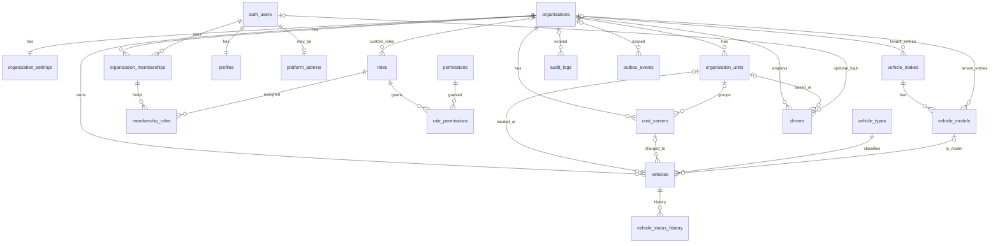

# HFM — Database Foundation (Etapa 01)

PostgreSQL 17 on Supabase. The database is the product's core infrastructure: integrity, security
and consistency are enforced in the database, never delegated to clients.

## 1. Principles

- Priority order: integrity → security → consistency → maintainability → performance → scalability.
- Multi-tenant from day one. Every tenant row carries `organization_id`; ownership is never inferred from the user alone.
- Authorization is RBAC with granular permission codes. Roles only group permissions; no `if role = 'admin'` anywhere.
- Master data has a single source of truth. Modules reference it by `id` and never copy plate, unit name, driver name, etc.
- Soft delete (`deleted_at`/`deleted_by`) for corporate master data; hard `DELETE` is never granted to application users.
- Everything is reproducible through versioned migrations in `supabase/migrations`.
- Simple and robust: no enums, no extra schemas beyond `public`/`private`, no queues or workers yet.

## 2. Entities

| Area | Tables |
| --- | --- |
| Tenancy | `organizations`, `organization_settings` (1:1), `organization_units`, `cost_centers` |
| Identity | `auth.users` (Supabase Auth), `profiles` (1:1, app data only), `organization_memberships`, `platform_admins` |
| RBAC | `permissions`, `roles`, `role_permissions`, `membership_roles` |
| Fleet master data | `vehicle_types`, `vehicle_makes`, `vehicle_models`, `vehicles`, `vehicle_status_history`, `drivers` |
| Cross-cutting | `audit_logs` (append-only), `outbox_events` (event infrastructure, no worker yet) |

Master data shared by all future modules: `organizations`, `organization_units`, `cost_centers`, `profiles`,
`drivers`, `vehicles`, `vehicle_types`, `vehicle_makes`, `vehicle_models`.

## 3. Multi-tenant strategy

- `organizations` is the tenant root. `organization_memberships (organization_id, user_id)` is the only link between
  a user and a tenant; a user may belong to several organizations.
- Access requires: membership `status = 'active'` **and** organization `status = 'active'` and not archived **and**
  profile `status = 'active'`. Anything else grants nothing.
- Child rows reference their parent with composite foreign keys `(organization_id, parent_id)` (e.g. `vehicles →
  organization_units`, `cost_centers → organization_units`), so a row can never point at another tenant's data.
- `organization_id` is immutable on every tenant table (`private.tg_prevent_tenant_change`).
- The tenant lifecycle (`organizations.status`, `deleted_at`) is platform-only: `organization.manage` edits the
  organization's data but cannot suspend or archive it, which would lock every member out.
- Global catalog rows (`roles`, `vehicle_makes`, `vehicle_models` with `organization_id IS NULL`) are readable by all
  authenticated users and writable only through migrations / `service_role`.

## 4. Authentication

- Identity lives exclusively in `auth.users`. No passwords or credentials in the application schema.
- `profiles.user_id → auth.users.id` (PK, cascade). Created automatically by `private.handle_new_auth_user()`
  (`AFTER INSERT ON auth.users`, SECURITY DEFINER, never fails the signup, never creates organizations or privileges).
- Users can update only `full_name`, `display_name`, `avatar_url` of their own profile (column-level grant + RLS).
  `profiles.status` (`active|blocked`) is changed only from privileged contexts.

## 5. RBAC

- `permissions.code` = `module.action` (e.g. `vehicles.archive`). Catalog managed by migrations (seeded in
  `..._seed_permissions_and_roles.sql`).
- `roles`: global platform roles (`organization_id IS NULL`, `is_system`, not editable) — `org_admin`, `fleet_manager`,
  `leadership`, `operator`, `viewer` — plus custom roles per organization. Custom codes cannot shadow global codes.
- `role_permissions` (N:N) and `membership_roles` (N:N). A role assigned to a membership must be global or belong to
  the same organization (`private.tg_membership_roles_guard`).
- Anti-escalation rules enforced in the database:
  - a user can never assign or remove roles on their **own** membership;
  - a role can only be assigned to someone else if the actor holds **every permission that role grants**
    (`private.role_within_actor_permissions`), so `members.manage` alone never produces an `org_admin`;
  - granting a permission to a custom role requires `roles.manage` **and** holding that permission yourself;
  - system roles, their permissions and the `is_editable` flag are frozen for application users;
  - removing a member, or archiving a role, deletes the corresponding `membership_roles` rows, so re-adding the
    member (or restoring the role) never silently restores old privileges;
  - `platform_admins` has no INSERT/UPDATE/DELETE path for application users.
- Platform administration (`platform_admins`) is separate from tenant administration. Platform admins hold every
  permission in every organization. Bootstrap (privileged SQL / `service_role` only):
  `insert into public.platform_admins (user_id, note) values ('<auth user id>', 'bootstrap');`

## 6. Row Level Security

- RLS is enabled on every `public` table. `anon` has no privileges on application tables or RPCs (also revoked from
  default privileges for future tables created by `postgres`).
- Helpers live in schema `private`, which is **not** in the API's exposed schemas (`supabase/config.toml` →
  `[api].schemas`, and the project's API settings must stay at the default `public, graphql_public, storage`).
  SECURITY DEFINER is used only where a helper must read
  RLS-protected tables (memberships, roles, platform_admins) without recursion; all have `search_path = ''` and fully
  qualified references.
  - `private.member_org_ids()` — organizations the caller can access.
  - `private.permitted_org_ids(code)` — organizations where the caller holds a permission.
  - `private.is_org_member(org)`, `private.has_permission(org, code)`, `private.is_platform_admin()` — scalar variants.
- Policy pattern (evaluated once per query as an InitPlan, not per row):
  `organization_id in (select private.permitted_org_ids('vehicles.view'))`.
- Policies never inspect another RLS-protected table through a plain subquery: a policy runs with the caller's own
  privileges, so `members.manage` without `members.view` would silently fail. The RBAC join tables use dedicated
  SECURITY DEFINER helpers instead (`can_view_membership`, `can_manage_membership_role`, `can_view_role`,
  `can_manage_role`, `can_grant_permission`).
- Reads require the module `*.view` permission; writes require `*.create` / `*.update` / `*.manage`. Archiving or
  restoring (changing `deleted_at`) requires `*.archive` (or `*.manage`) through `private.tg_guard_soft_delete`, and
  archived rows are visible only to holders of that permission.
- `organizations` are created only through `public.create_organization()`; memberships/roles are managed with
  `members.manage`; custom roles with `roles.manage`.

## 7. Audit

- `audit_logs` is append-only (trigger blocks UPDATE/DELETE, even for the owner; purge requires
  `set_config('hfm.allow_purge','on',true)` from a privileged session). No FKs: rows outlive entities.
- `private.tg_audit()` (SECURITY DEFINER) is attached to every core and master data table except `profiles`
  (personal data — LGPD minimization) and history tables. It stores `old_data`/`new_data` (JSONB), `changed_fields`,
  actor (`auth.uid()`), organization and the `x-request-id` header when present. Updates touching only
  `updated_at/updated_by` are not logged. Trigger arguments can redact sensitive columns.
- `vehicle_status_history` records every status change (trigger, SECURITY DEFINER). Use
  `public.set_vehicle_status(vehicle_id, status, reason)` to attach a reason; it runs as the caller (RLS applies).
  The foreign key to `vehicles` is `RESTRICT` and `changed_by` carries no foreign key: traceability outlives both
  the vehicle row and the user account.

## 8. Conventions

- `id uuid primary key default gen_random_uuid()`; business identifiers (plate, VIN, RENAVAM, CNPJ, codes) are never
  primary keys and are unique per organization among non-archived rows (partial unique indexes).
- `snake_case`, `timestamptz`, `created_at/created_by/updated_at/updated_by` maintained by `private.tg_set_stamps()`
  (created_* immutable), `deleted_at/deleted_by` for soft delete.
- Statuses are `text` with named CHECK constraints (evolve with `ALTER TABLE ... DROP/ADD CONSTRAINT`), not enums.
- Codes are normalized to upper case; plates/VIN/RENAVAM are normalized (separators removed) and RENAVAM is
  zero-padded to 11 digits, so a pre-2013 9-digit number cannot slip past the per-tenant unique index. CNPJ is
  stored as text (alphanumeric CNPJ compatible) with separators stripped, and is not unique (a group may register
  several tenants under related documents).
- Authorship cannot be forged: `created_by`/`updated_by` are always taken from `auth.uid()` when a caller is
  authenticated, and `created_at`/`created_by` are immutable afterwards.
- Units and cost centers are unique per tenant by code **and** by name, so a row without a code is still
  identifiable. An active vehicle, driver or cost center can never point at an archived parent.
- Delete rules: `RESTRICT` from master data to `organizations`; `CASCADE` only for pure children (settings, role grants,
  status history of a hard-deleted vehicle); `SET NULL` for `*_by` actor columns.
- JSONB only in `audit_logs` (snapshots) and `outbox_events.payload`.
- Every new table must: enable RLS, add policies using the helpers above, revoke from `anon`, attach
  `tg_set_stamps` and `tg_prevent_tenant_change`, and add `tg_audit` when it is a business entity.

## 9. RPC surface

| Function | Security | Purpose |
| --- | --- | --- |
| `public.create_organization(name, slug, owner_user_id?, ...)` | DEFINER, platform admin or `service_role` | Atomic bootstrap: organization + settings + owner membership + `org_admin` |
| `public.set_vehicle_status(vehicle_id, status, reason?)` | INVOKER (RLS) | Status change with reason in history |
| `public.current_user_permissions(organization_id)` | INVOKER | Permission codes of the caller (for UI) |

Future onboarding (self-service signup, invitations by e-mail) will wrap these in its own transactional RPCs; user
signup never creates an organization.

## 10. Adding a module (checklist)

1. Reference master data by id: `organization_id` (always), `vehicle_id`, `driver_id`, `organization_unit_id`,
   `cost_center_id` — use composite FKs `(organization_id, <parent_id>)` to the parent's `(organization_id, id)` key.
2. Never copy plate, model, unit name, driver name or cost center into the module table.
3. Add only the applicable stamps (`created_*`, `updated_*`, `deleted_*`).
4. Add permission codes to the catalog (`module.view`, `module.create`, ...) and grant them to the platform roles in a
   seed migration; write policies with `private.permitted_org_ids('<code>')`.
5. Enable RLS, revoke `anon`, attach `tg_set_stamps`, `tg_prevent_tenant_change`, `tg_guard_soft_delete('<code>')`
   when soft-deletable, and `tg_audit` when auditable.
6. Emit domain events with `private.emit_event(...)` when other modules must react (consumer worker to come).
7. Regenerate types: `npm run db:types`. Add tests in `supabase/tests/database`.

## 11. ERD

## 12. Operations

- Apply: `supabase db push` (or the Supabase MCP `apply_migration`, which is how the Dev project was provisioned).
- Types: `npm run db:types` → `src/types/database.types.ts` (generated, never hand-edited).
- Tests: `npm run db:test` locally (pg_prove over `supabase/tests/database`), or build a console script with
  `supabase/tests/build_script.sh <test file>`. Every test runs in a transaction that is rolled back.
- Lint: `npm run db:lint` and the Supabase security/performance advisors.

### Known advisor output (reviewed, intentional)

| Advisor | Object | Why it stays |
| --- | --- | --- |
| `rls_enabled_no_policy` (INFO) | `outbox_events` | RLS on with no policy is the intent: only `service_role` workers touch the outbox. |
| `authenticated_security_definer_function_executable` (WARN) | `create_organization` | The function must be callable to be usable; it authorizes internally (platform admin or `service_role`) and raises otherwise. |
| `unindexed_foreign_keys` (INFO) | `*_created_by` / `*_updated_by` / `*_deleted_by` | Never query predicates. The only cost is a scan when an `auth.users` row is deleted, which is rare; ~25 extra indexes would tax every write. |
| `unused_index` (INFO) | new indexes | Expected on a database with no traffic yet. |
